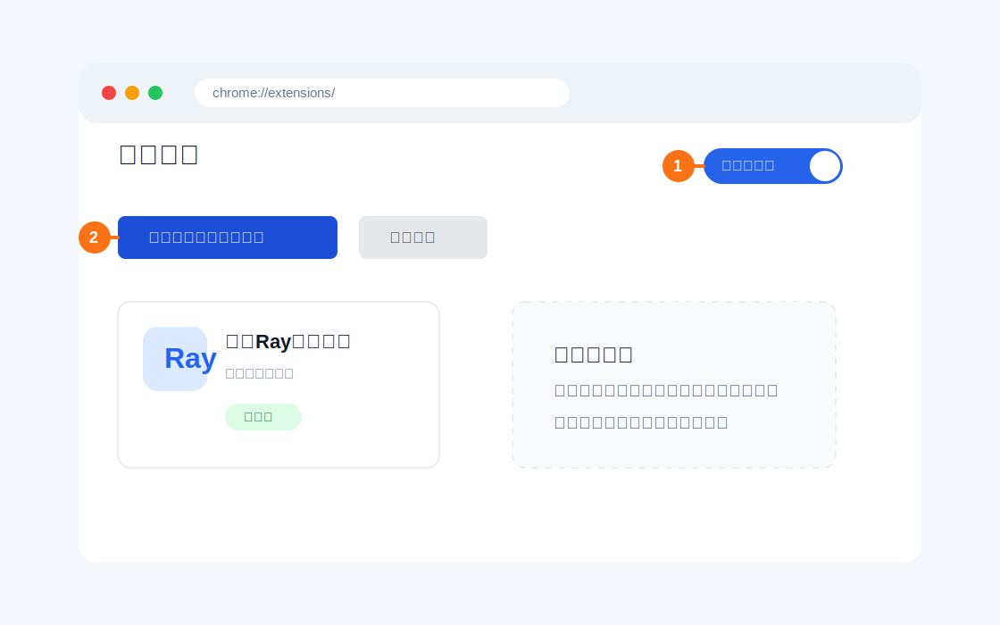
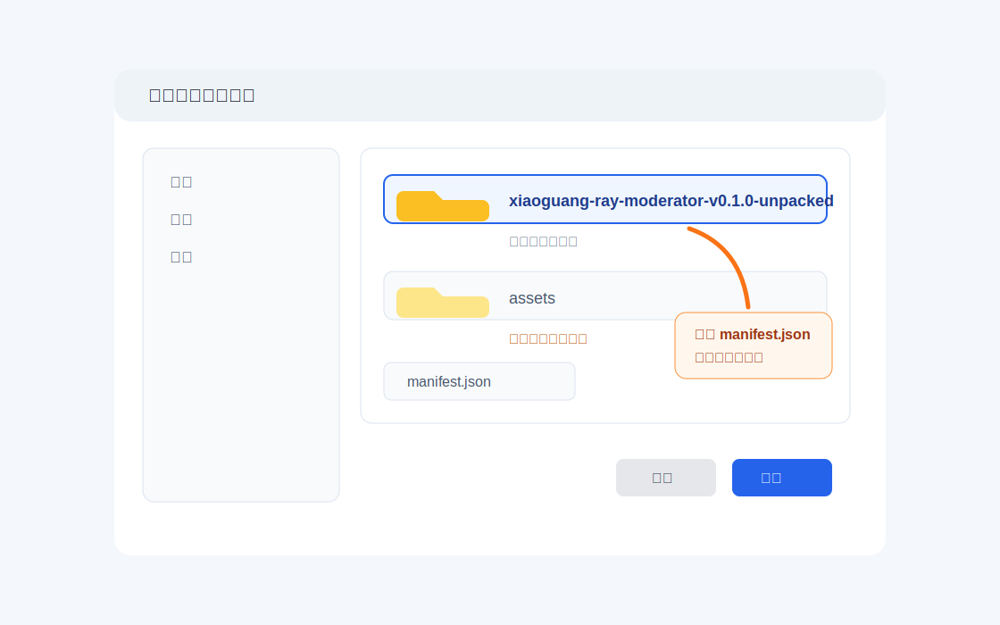
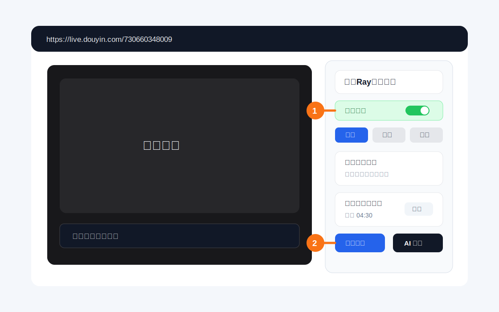
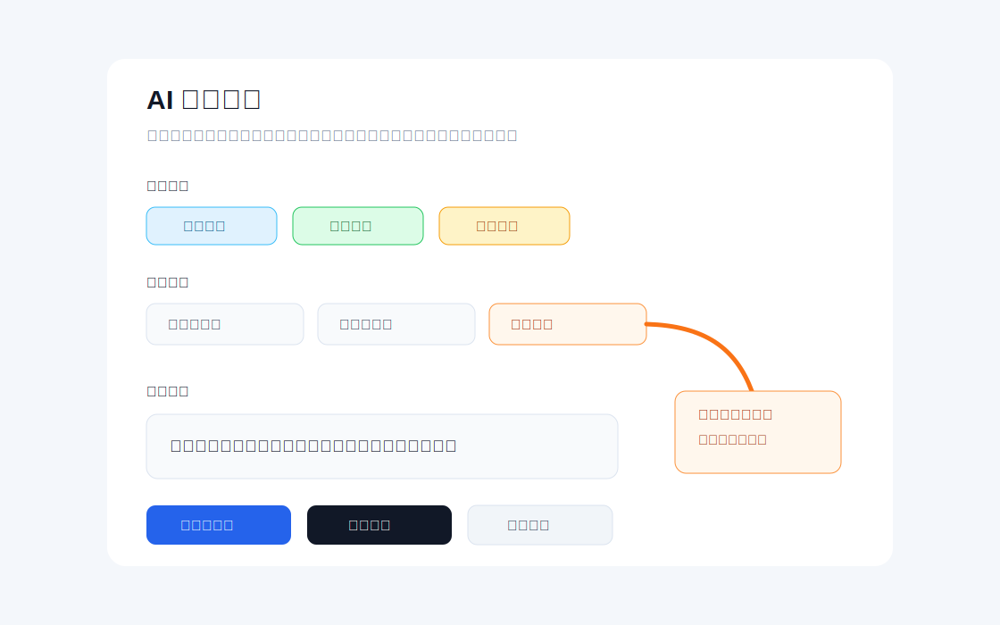

# 小光Ray房管助手使用说明

这份说明给拿到插件包的人使用。插件内部的开发者模式已经隐藏，并且默认关闭；下面安装步骤里的“开发者模式”指的是浏览器扩展管理页用于加载本地插件的开关。

## 一、安装插件

1. 解压 `xiaoguang-ray-moderator-v0.1.0.zip`。
2. 双击解压后目录里的 `打开安装页面.cmd`，它会自动打开插件文件夹和浏览器扩展管理页。
3. 如果脚本没有打开浏览器，也可以手动打开 Chrome 或 Edge 的扩展管理页。
   - Chrome: 在地址栏输入 `chrome://extensions/`
   - Edge: 在地址栏输入 `edge://extensions/`
4. 打开页面右上角的“开发者模式”。
5. 点击“加载已解压的扩展程序”。
6. 选择解压后的 `xiaoguang-ray-moderator-v0.1.0-unpacked` 文件夹。

选择文件夹时，请选中包含 `manifest.json` 的那一层目录，不要选到 `assets` 子目录里。

安装完成后，可以把“小光Ray房管助手”固定到浏览器工具栏，方便查看插件状态。

## 二、打开直播间

1. 先在浏览器里登录抖音网页端。
2. 打开目标直播间：`https://live.douyin.com/730660348009`
3. 等页面加载完成后，右侧会出现“小光Ray房管助手”面板。

如果没有看到面板，先刷新直播间页面，并确认当前地址是目标直播间地址。

## 三、日常使用

- 顶部“开始/暂停”是本页总开关；显示“运行中”时，规则回复和定时发送才会执行。
- “托管模式”默认关闭。需要无人值守时，先打开“托管模式”，插件检测到开播后会自动刷新直播页，并打开总开关、定时弹幕池和自动点赞。
- “定时弹幕池”控制循环弹幕；关闭后不会继续发送池里的定时弹幕。
- “自动点赞”默认关闭。手动打开后会立即点赞一次，并进入 62 分钟循环；关闭后不会重置下一轮倒计时。
- “重置窗口”和“重置点赞”可以手动重启对应倒计时。
- “立即发送”适合只发一次的 AI 弹幕，不会加入弹幕池循环发送。
- 修改规则、定时弹幕或话术后，建议先观察一两轮发送效果，再长时间托管。

## 四、AI 弹幕

AI 定时弹幕支持三类生成：

- 普通互动：用于常规打 call 和直播间气氛维护。
- 杂谈话题：可以对主播或观众发起音乐、游戏、动漫、体育比赛类话题。
- 安慰鼓励：用于安慰生气、伤心、沮丧或压力大的主播/观众。

“杂谈话题”里选择“近期热门”时，会通过 DeepSeek Web Search 搜索近期热点，生成时间可能比普通弹幕更长。网络不稳定或搜索结果不足时，可以改用“普通话题”。

## 五、常见问题

### 看不到插件面板

- 确认插件已启用。
- 确认打开的是 `https://live.douyin.com/730660348009`。
- 刷新直播间页面。
- 如果刚刚安装或更新插件，刷新页面后再试。

### 弹幕没有发出去

- 确认当前浏览器已登录抖音。
- 确认直播间页面没有被弹窗、登录框或验证码挡住。
- 先手动发送一条弹幕，确认网页端输入框可以正常使用。

### AI 热门话题没有返回

- 等待更久一点，近期热门会先搜索再生成。
- 检查网络是否能访问 DeepSeek API。
- 临时切换为“普通话题”，或换一个话题分类再试。

### 更新插件

1. 解压新的插件包。
2. 打开浏览器扩展管理页。
3. 找到“小光Ray房管助手”，点击“重新加载”。
4. 如果路径变了，可以删除旧插件后重新“加载已解压的扩展程序”。
